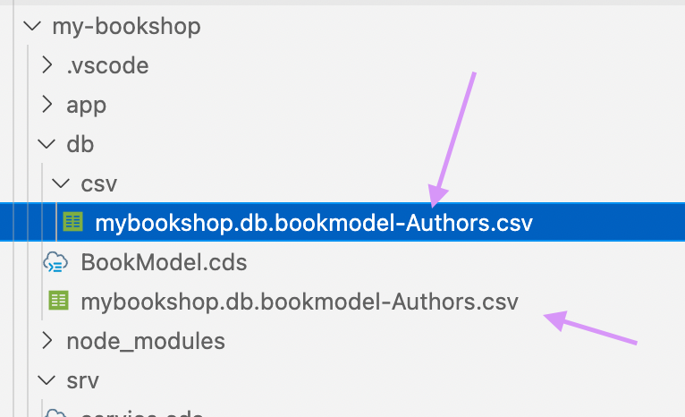
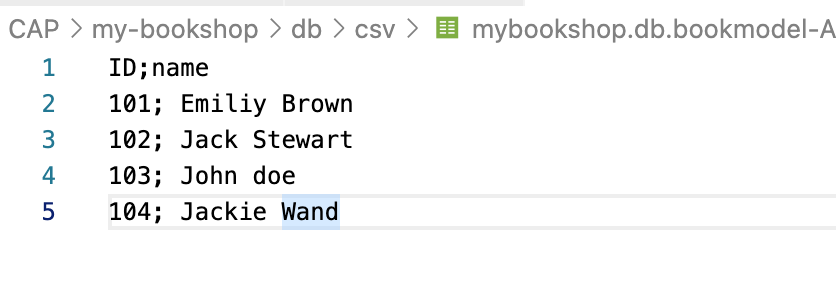

# Add Initial Data - My Bookshop Project 

Earlier in the tutorial, we added the data for the service, in the Service.js file implementing service.on('read'....). 
In this section, we will see how to load the initial data from the CSV file. 

I am going to populate the entity "Authors" with data from CSV files. Hence i am commenting the code earlier written in the Service.js file. 

Next, create a CSV file in the db folder and add the data to the file. The name of the CSV file should follow this naming convention. 

``` 
  <namespace>-<entity_name>.csv
```

In my application, i have given the namespace for the DataModel file as ```mybookshop.db.bookmodel``` and the entity name as ```Authors```. 
Hence the name of the CSV File i have created is ```mybookshop.db.bookmodel-Authors.csv```. This file can be in the same in the directory path as the Model or to organizae we can store the csv file inside a folder named csv within the same directory as model. The file can be in one of the location in below screenshot. I am adding my files in the csv folder.



The Authors entity has two properties named ```ID``` and ```name```. 
The column needs to be seperated with a ```;```. 
I have maintained data as below. 



> Sometimes for the changes to reflect we need to stop the server and restart it with command ```cds watch```.

Restart the CDS Server and Click on Authors Entity to view the entity data. 

**Result**


