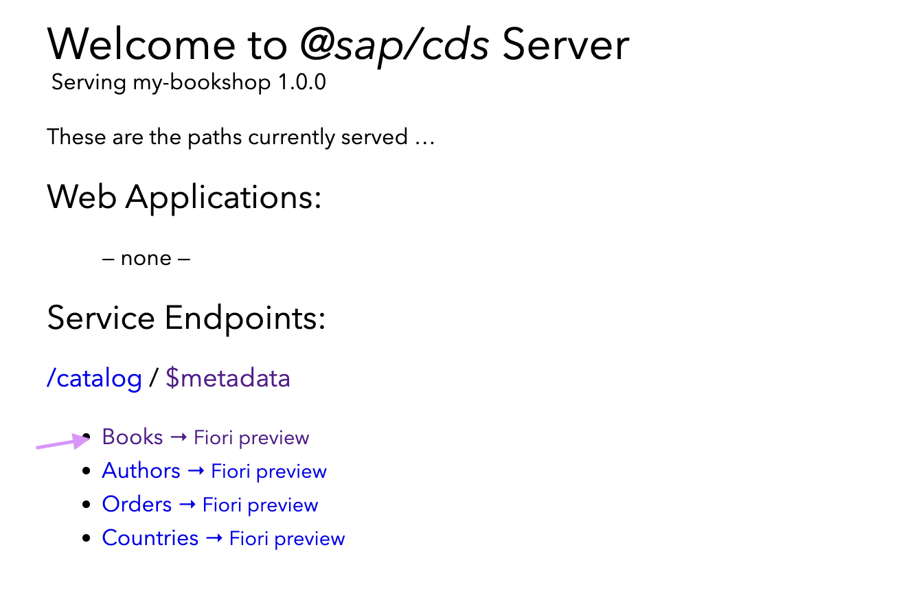
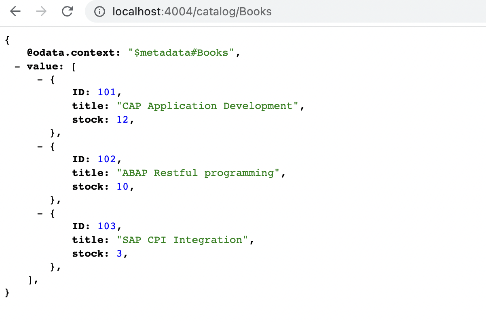

# Add Mock Data to the Service - My Bookshop Project

To add Mock data to the service, create a new file in the ```srv``` folder named ```service.js```. 

Add the following code to return mock data when the read on entity is triggered.

```javascript

module.exports = (srv) => {

    // Mock data for Books 
    srv.on('READ','Books', () => [
        { ID: 101, title: 'CAP Application Development', Author_ID: '101', stock: 12 },
        { ID: 102, title: 'ABAP Restful programming', Author_ID: '101', stock: 10 },
        { ID: 103, title: 'SAP CPI Integration', Author_ID: '102', stock: 3 }
    ])

    srv.on('READ','Authors', () => [
        { ID: 101, name: 'Emily Brown' },
        { ID: 102, name: 'Richard Billy'}
    ]);

}

```

Save the file. 

In the localhost server running click on the Books Entity link to see the data preview. 




**Data Preview** 


