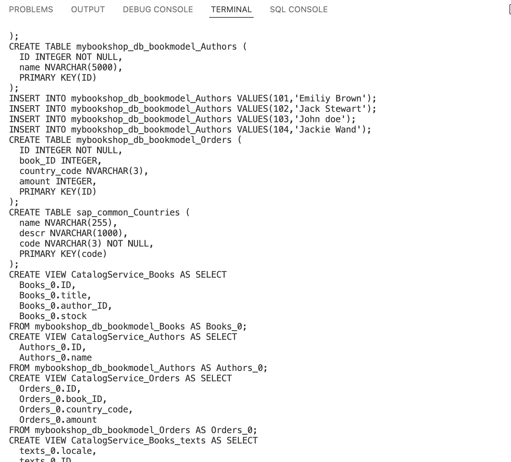

# Add a persistent database - My Bookshop Project.

To add the data to the persistant database, we use SQLite3. 

To install the SQL Lite DB, execute the following command in terminal.

```
npm i sqlite3 -D
```

Once the SQLite3 packages is installed, execute the following command in the terminal to create a SQLite database in our application.

```
cds deploy --to sqlite:db/my-bookshop.db
```

After executing this command, you can see a file created with the name my-bookshop.db in the db folder. 

We cannot see the contents of the .db file, if you open with text editor you can see some pieces of code generated which you can relate to the entities
we defined in the db folder. So what the framework does is identify the entity in the db folder and creates the table for these entity to be persisted 
in the sql database. 

To view the SQLite DB in the console, you can execute the following command. 

```
sqlite3 db/my-bookshop.db -cmd .dump
```

In the terminal , you can see the SQL Create Statements generated for each of the entitysets we defined. 



Stop the local host server using control + c. and restart the server using cds watch. 

Now we should be able to test our service for CRUD Operations. 

SAP have provided a sample [postman collection](https://raw.githubusercontent.com/SAPDocuments/Tutorials/master/tutorials/cp-apm-nodejs-create-service/postman.json). You can import the postman collection and modify it as per your service and test it, or you can create the postman collection and configure on your own and test it. 
