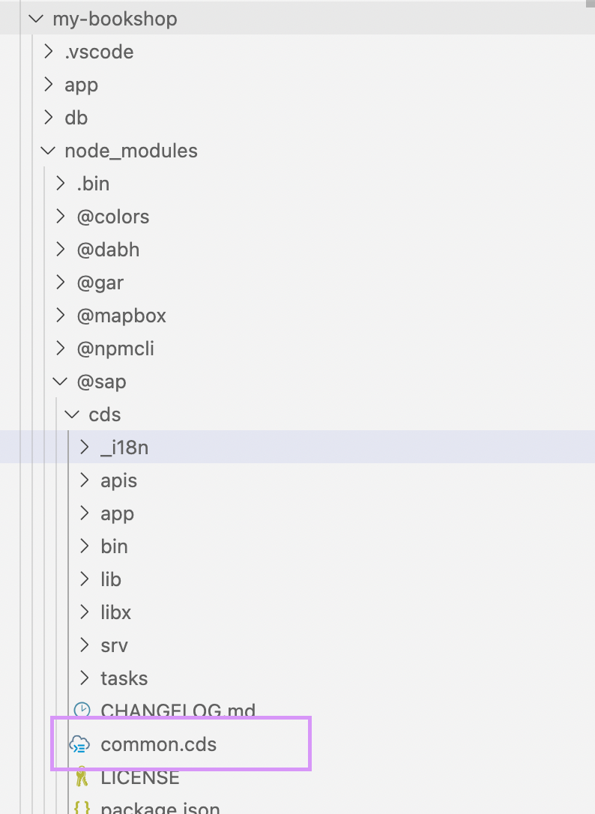

# Common CDS from SDK

Common CDS is a reusable model that is pre-built and shipped as part of CAP CDS. 

```
@sap/cds/common
```

The advantages of using reusable models is to reduce the implementation efforts, streamline the project development. Optimize implementation and runtime performance. Automated support for localization and value helps. Additional properties required can be extended using [Aspects](aspect.md).

After [initializing your project](set-up-new-project.md) and installing the node package, navigate to the path ```node_modueles/@sap/cds/common.cds```.




### Types

The Common CDS, has the following types declared which we can reuse in our program. 

```
type Language : Association to sap.common.Languages;
type Currency : Association to sap.common.Currencies;
type Country : Association to sap.common.Countries;
type User : String(255);
```

The Common CDS, has four types declared in it. 
The Types Language, Currency and Country are Associated to Entities Languages, Currencies and Country of the Same Context and provide value helps based on the association and annotation added in the CDS View. 

If we want to use the any type from the Common CDS View, we need to import the type and we can use it in our entity. 

**Example** 

```
  using { Country } from '@sap/cds/common';
  
  entity Address {
    street: String(40);
    town: String(40);
    country: Country; // Reused from @sap/cds/common
  }
```

### Entity

The Common CDS View has 3 Entities which provides data and can be reused. All entity extend an aspect CodeList which can be used for your own code list. 

**Aspect Code List** 
```
  aspect CodeList @(cds.autoexpose, cds.persistence.skip: 'if-unused'
  {
    name: localized String(255) @title: 'i18n>Name';
    descr: localized String(1000) @title: 'i18n>Description';
  }
```

The Aspect Code List is annotated with the auto expose and presistance features to avoid storing of data if un-used. 
It has localized element name and description annotated with title. Read more about [Localization](localization.md).

**Entity List**

``` 
context sap.common {
  
  entity Languages: CodeList {
    key code: String(14) @(title: '{i18n>LanguageCode}');
  }
  
  entity Countries: CodeList {
    key code: String(3) @(title: '{i18n>CountryCode}');
  }
  
  entity Currencies: CodeList {
    key code: String(3) @(title: '{i18n>CurrencyCode}');
        symbol: String(5) @(title: '{i18n>CurrencySymbol}');
  }
  
}

```

### Aspects 

The common cds view has the following aspects. 

1. CUID 
2. Managed 
3. Temporal 

**CUID**: 
Provides an Universal ID, automatically filled in. 

```
aspect cuid: {
  key ID: UUID; // automatically filled in 
}
```

**Managed**:

```
/* 
 * Aspect to capture user name and time
 */
aspect managed {
  createdAt: Timestamp @cds.on.insert: $now;
  createdBy: User @cds.on.insert: $user;
  modifiedAt: Timestamp @cds.on.insert: $now @cds.on.update: $now;
  modifiedBy: User @cds.on.insert: $user @cds.on.update: $user;
}
```

By using this managed aspect in your entity, you entity tracks the user and time in which the data is manipulated by default. 

**Temporal**

Temporal aspect captures the valid from and valid to Data. 

```
  aspect temporal {
    validFrom: Timestamp @cds.valid.from;
    validTo: Timestamp @cds.valid.to;
  }
```


### Annotation 

The Entites are annotated in the common CDS view inorder to provide built in value list for Fiori Elements. 

Following are the annotations maintained for the **Entities**

**Code List** 

```
  annotate sap.common.CodeList with @UI.Identification: [{Value: name}];
  annotate sap.common.CodeList with @cds.odata.valuelist;
```

**Languages, Currencies and Countries**

```
  annotate sap.common.Languages with { code @Common.Text: name; }
  annotate sap.common.Currencies with { code @Common.Text: name; }
  annotate sap.common.Countries with { code @Common.Text: name; }
```

Following are the annotation for the types. 

**Type**

```
  annotate User with @( 
    title: '{i18n>UserID}',
    description: '{i18n>UserID.Description}'
  )
```

Similar annotation is given for language, currency and country. 

Annotation for Managed as follows:

```
  annotate managed with @(
    createdAt @title: '{i18n>CreatedAt}';
    createdBy @title: '{i18n>CreatedBy}';
    modifiedAt @title: '{i18n>ChangedAt}';
    modifiedBy @title: '{i18n>ChangedBy}';
  )
```


