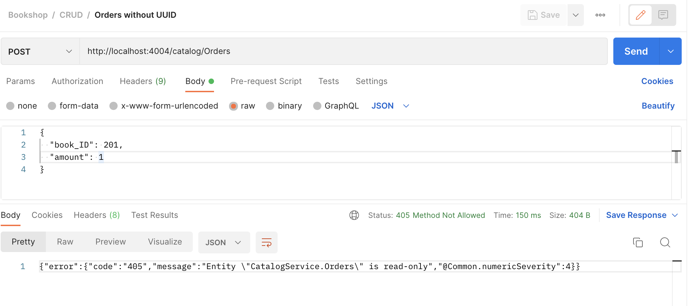
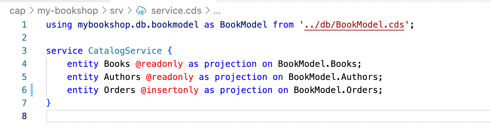
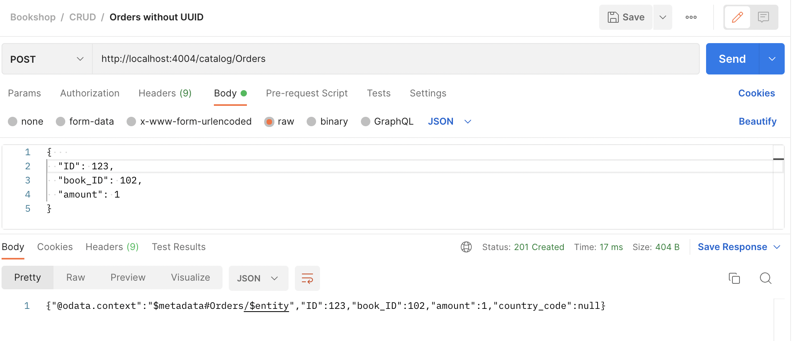
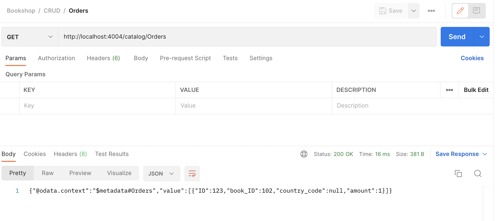
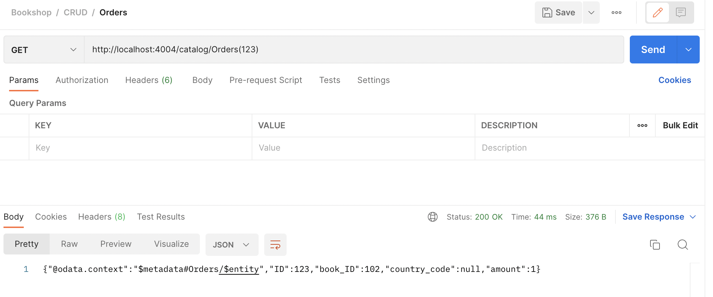

# Method: CREATE - Orders Entityset

Earlier, we tested the `get entityset` and `get entity` for the Bookshop Service. 
We did not provide any data for the `Orders` entityset. In order to add a new records to the entityset trigger a `POST` call for `Orders` entityset. 

**Method**: `POST`

```
http://localhost:4004/catalog/Orders
```



> It is expected to raise an error message since in service definition we have added the annotations `@readonly`

I have modified the `@readonly` to `@insertonly`.



After modification, restart the service using `cds watch` and trigger the `POST` request for `Orders` entityset. 



> For the records to be persisted in the database, make sure you deployed the `sqlite3` database. If you have not completed it, refer to the step [Add persistent database](add-persistent-db-mybookshop.md)

After the records is successfully inserted, exectue the `GET` calls to verify the data. 

> Note: Since we modified the annotation to `@insertonly` only the `POST` method works. To enable the all the type of request, i have removed the `annotations`.

**Method**: `GET`

```
http://localhost:4004/catalog/Orders
```



Use the Key in the URL for the single order. 

```
http://localhost:4004/catalog/Orders(123)
```



