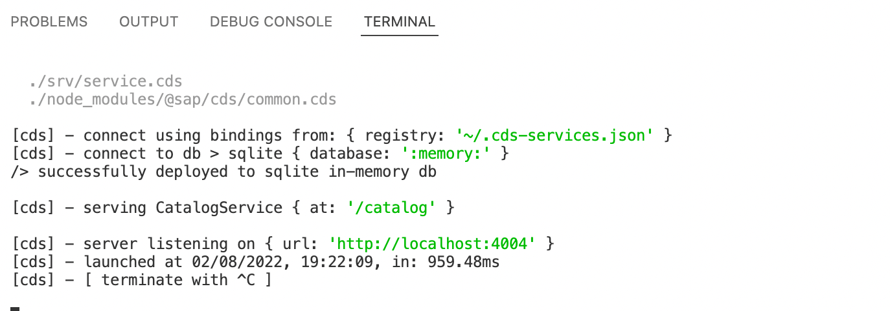
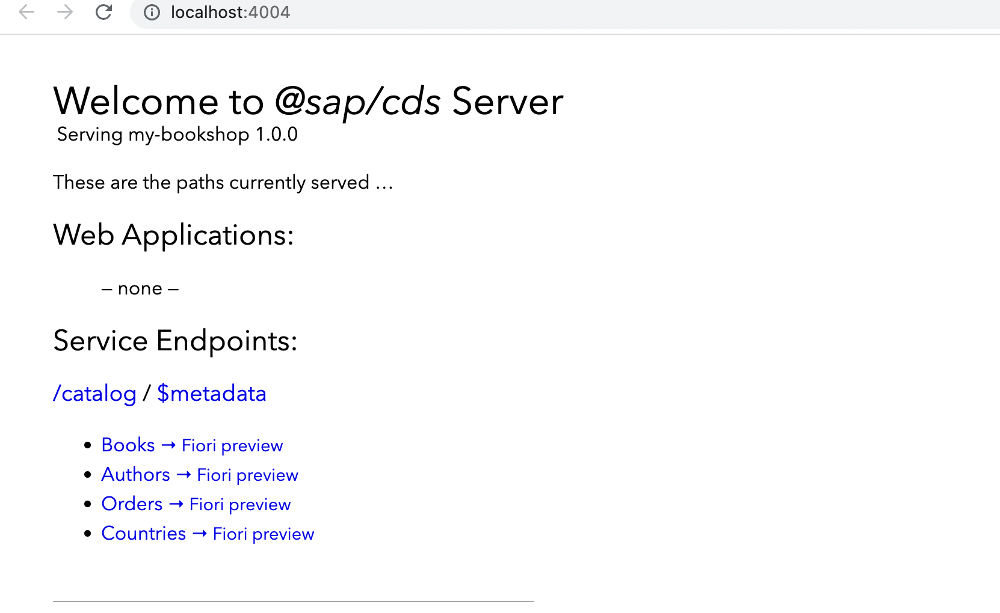
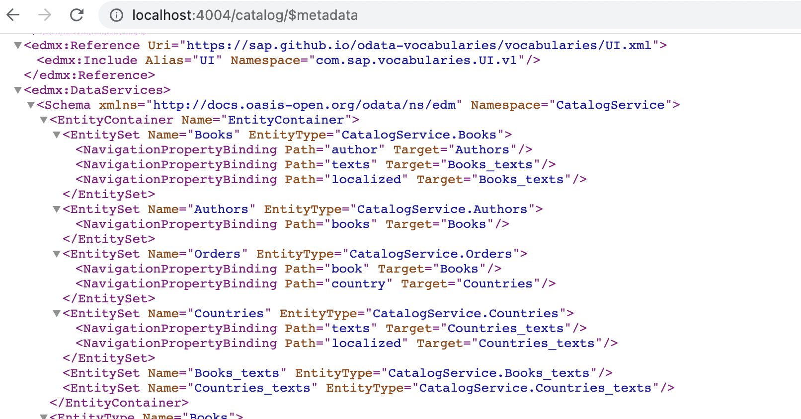
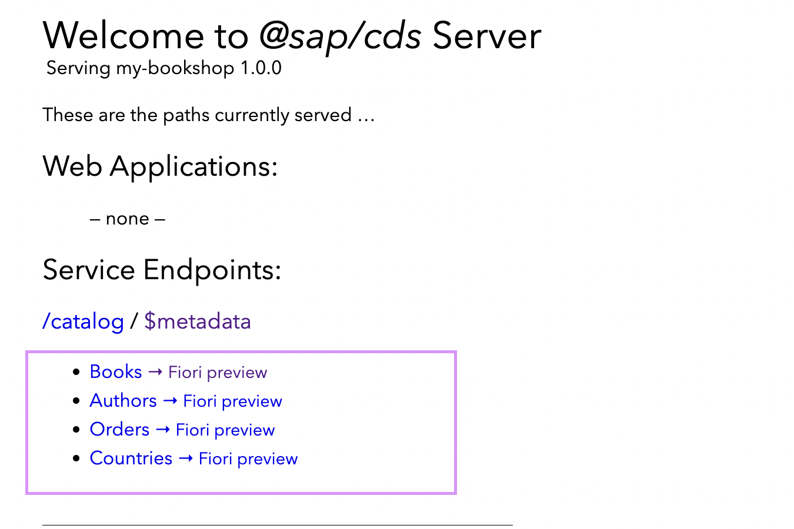

# Define the Service - My Bookshop Project 

To add contents to the app, define a service by adding a simple [Domain Model](domain-model.md).

As a pre-requisites, i would recommend you read the following concepts to understand better the service that we are going to build. 
It is important to understand the following terms
- [What is an Aspect?](aspect.md)
- [What are Entity and Types](entity-and-types.md) 
- [Why we use @sap/cds/common cds](common-cds-sdk.md)

In the srv folder, create a new file with an extension .cds 

Create a new file called service.cds. The sooner you create this file, the cds watch command that you executed earlier in the previous step starts the servce. 

To add the service definition in the CDS, use the following code. Define a service and wrap the entities in the service. 

```
  
using {Country,managed} from '@sap/cds/common';
service CatalogService {
    entity Books {
        key ID: Integer;
            title: localized String;
            author: Association to Authors;
            stock: Integer;
    }
    entity Authors {
        key ID: Integer;
            name: String;
            books: Association to many Books on books.author = $self;
    }
    entity Orders {
        key ID: Integer;
            book: Association to Books;
            country: Country;
            amount: Integer;
    }
}

```

Click on Save. 

You can see the server started on the terminal console. 



In case if the session is already terminted and you want to restart, you can use the command ```cds serve``` or ```cds watch```.

You can see the localhost server started with the endpoints. 



**Service Metadata** 

Click on the link to $metadata to see the service metadata. 



For each of the entity generated as part of the service, a fiori preview is generated. 




We don't see anything at the moment, as we have not added any annotations yet. 


