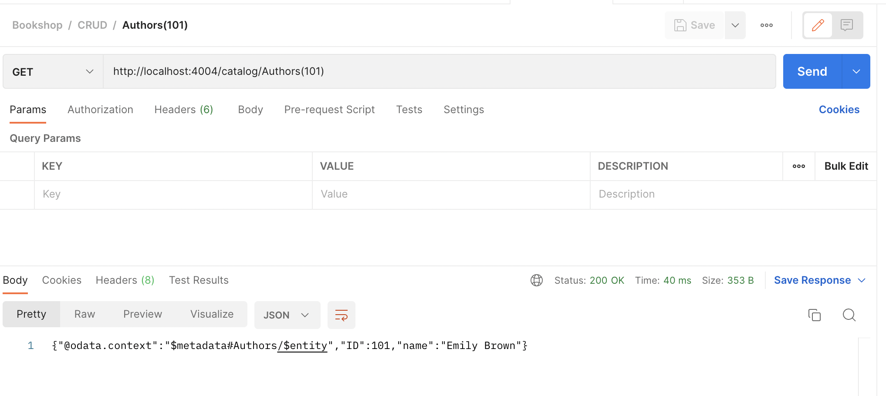
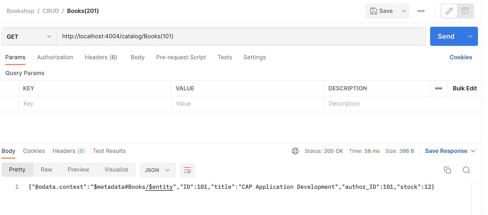

# Request for Get Entity - My Bookshop Project

#### Entityset: `Authors`

**Method**: `GET`

```
http://localhost:4004/catalog/Authors(101)
```



#### Entityset: `Books`

**Method**: `GET`

```
http://localhost:4004/catalog/Books(101)
```



> To read the specific books, i have commented the code in `service.js` file which returns the data and added the data through csv file. 