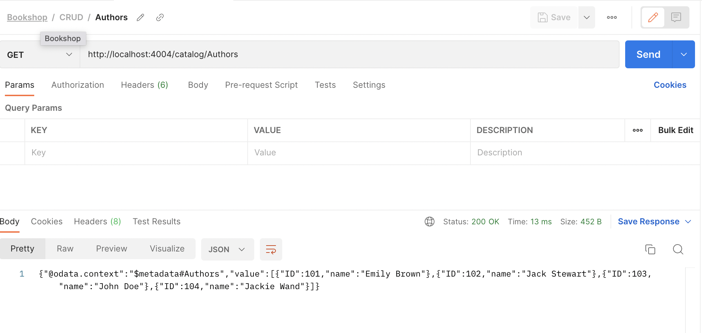
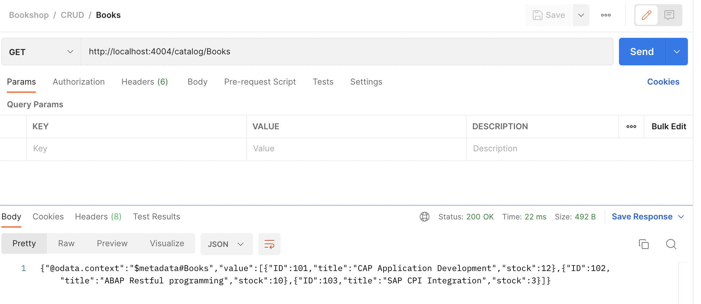
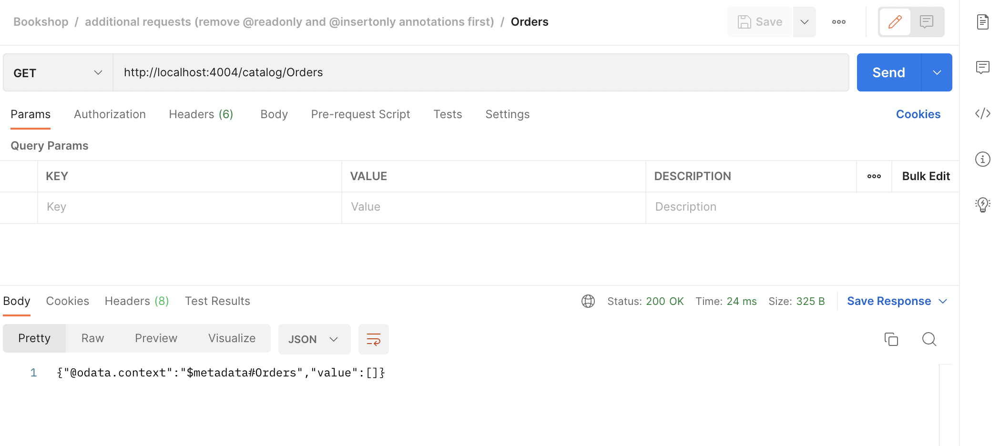

# Request For Get Entityset - My Bookshop Project

In the service we have developed, we have the following entities. 

1. Books
2. Authors
3. Orders
4. Countries

#### Entityset: `Authors`

**Method**: `GET`

```
http://localhost:4004/catalog/Authors
```




#### Entityset: `Books`

**Method**: `GET`

```
http://localhost:4004/catalog/Books
```



#### Entityset: `Orders`

**Method**: `GET`

```
http://localhost:4004/catalog/Orders
```



> For the entityset Authors and Books we loaded the data from the csv file and service.js.  For the entityset orders we have not created any data yet, hence empty result returned. As for the entityset Countries data is returned from the common cds.