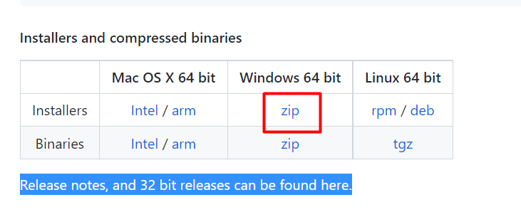
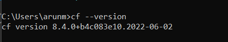

# Install Cloud Foundry Command Line Interface

To deploy the app and services to the SAP BTP, we require the Cloud Foundry Command Line Interface.

[CF CLI Official Site](https://docs.cloudfoundry.org/cf-cli/install-go-cli.html)

<!-- tabs:start -->

#### **Mac OS**

To install cloud foundry on the Mac OS we require `Brew`. To Confirm if we have `brew` installed already execute the following command in the `zsh` terminal.

```
brew --version
```

if the Brew is installed, you will get the output of Version details. If not visit [Brew Website](https://brew.sh/)
and install the the `brew`.

Once the `brew` is installed, execute the following command to install the cloud foundry.

```
brew install cloudfoundry/tap/cf-cli
```

To confirm the cloud foundry version, run the commnad below.

```
cf --version
```

For linux and Mac OS, we can use Brew installer to install the cloud foundry. Or we can also download the Binary from the [Cloud Foundry](https://github.com/cloudfoundry/cli#installers-and-compressed-binaries) github.

#### **Windows OS**

For windows Operating system, we have the installer software to install the Cloud foundry in the device.

[Download](https://github.com/cloudfoundry/cli/wiki/V8-CLI-Installation-Guide) the Zip file and extract the files. You will find the installer software. Double click on it and install it.



To Confirm if the cloud foundry is installed, open the command and execute the following command.

```
cf --version
```

Output:



<!-- tabs:end -->
