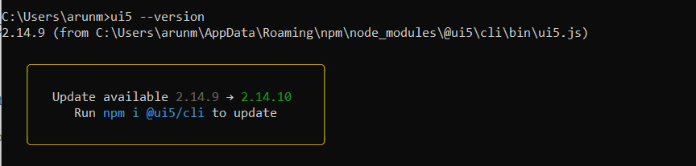

# Install UI5 Command Line Interface

For UI5 development, we will be using the UI5 Commands to initialize and build the projects.
To Install the UI5 CLI tools, you need to have Node JS runtime installed first on your device.

SAP has provides an Node Packge `@ui5/cli` to install the command line tools.

Read more about UI5 CLI Tooling [here](https://sap.github.io/ui5-tooling/pages/CLI/).

Node JS Package: [@ui5/cli](https://www.npmjs.com/package/@ui5/cli)

If you have not installed Node JS yet, follow this step [Install Node JS](install-node-js.md)

To Install the UI5 CLI tool on global space, run the following command in your terminal.

```
npm install --global @ui5/cli
```

Once the package is installed you can execute the following command to verify the installation and to see the version.

```
ui5 --version
```

**Output**


