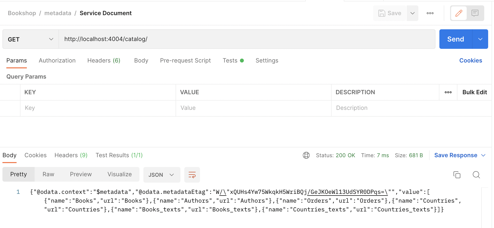
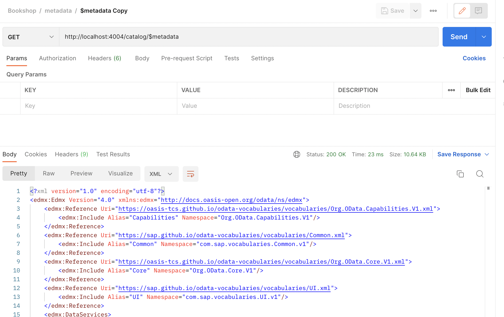

# Test the Service on Postman - My Bookshop Project 

### Service Document and Metadata 

Host in which the server is running : http://localhost:4004

#### Service Path:

**Method**: `GET`

```
http://localhost:4004/catalog
```



#### Service Metadata:

**Method**: `GET`

```
http://localhost:4004/catalog/$metadata
```




