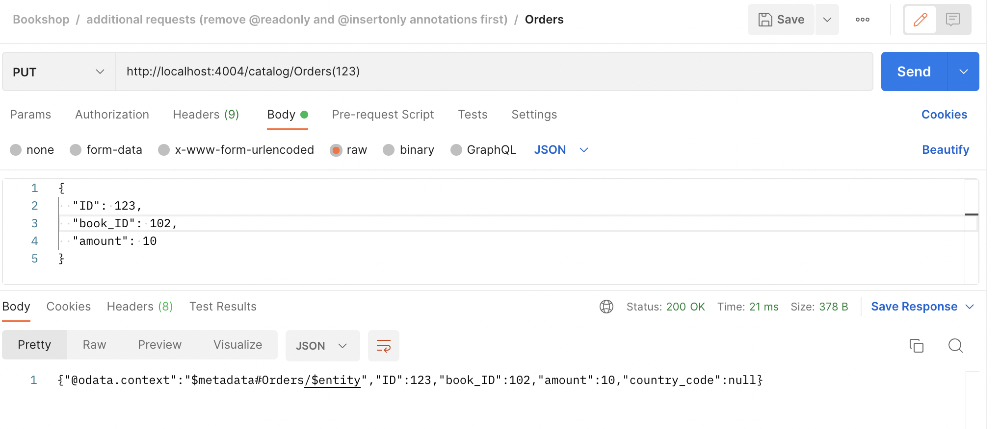
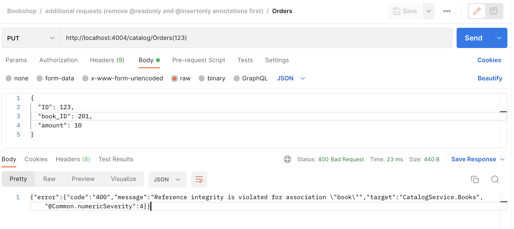

# Method: PUT - Update Entity 

Trigger the PUT request to update the order we inserted in previous step. 

**Method:** `PUT`

Let us update the amount for the Orders. 

```
http://localhost:4004/catalog/Orders(123)
```



**Validation**

The system automatically validates the data against the associated enitity while doing executing the requests. 

Example: In this entityset, we are passing the Book ID as `102` which is a valid entry. Now let's modify to `201` which does not exist. the update should fail now. 

