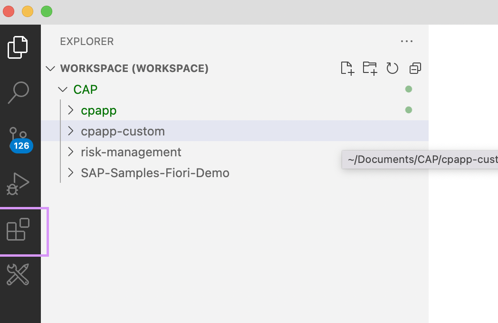
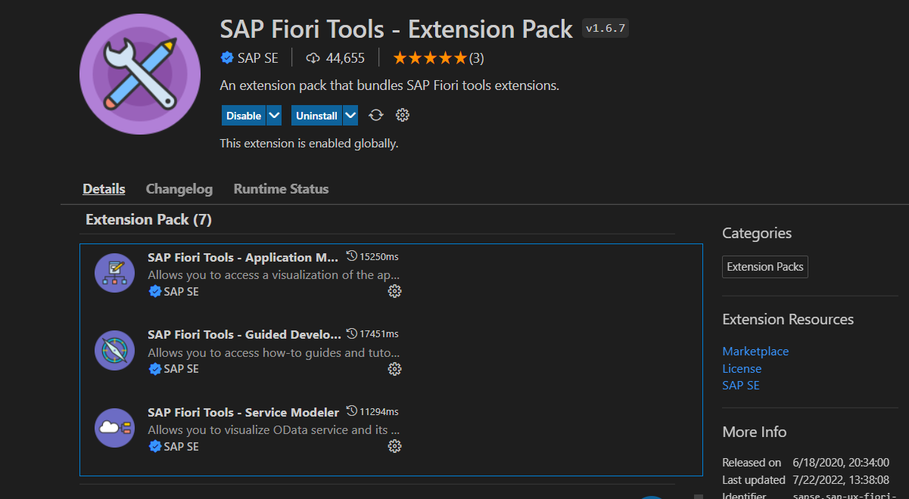

# Install Visual Studio Code Plugin for Fiori Elements

In this tutorial, you learn how to install the VS Code extension plugin for Fiori Elements.

#### Step 1: Go to the VS Code Extension Manager.

#### Step 2: Install SAP Fiori Elements.

Search for the extension `SAP Fiori Tools: Extension Pack`.

