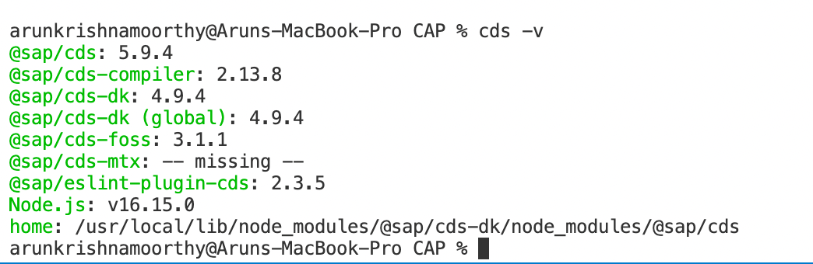

# Set Up CAP Development Environment

To Get started with CAP development, we require the following to be installaed in the machine. 

1. Node JS
2. SQL Lite ( Only for Windows OS )
3. CDS Node Package (@sap/cds-dk)

### Install Node JS 

### Install SQL Lite

### Install CAP Node Package

To Install the CDS Node Package, execute the following command in the terminal. 

```
npm i -g @sap/cds-dk
```

To verify CDS Version installed in the VS Code, run the command below to verify the CDS installation. 

```
cds -v
```




