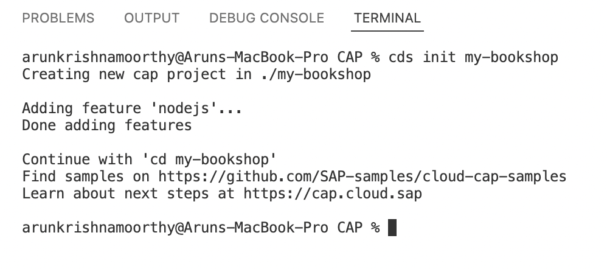
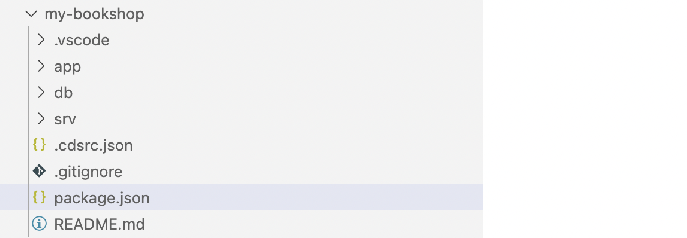
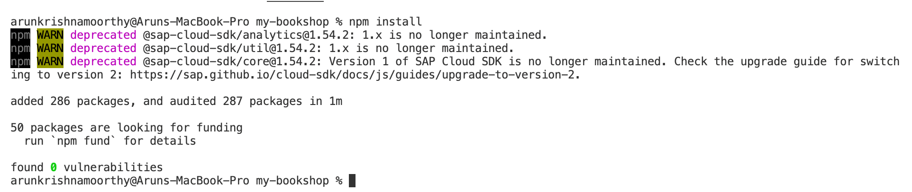
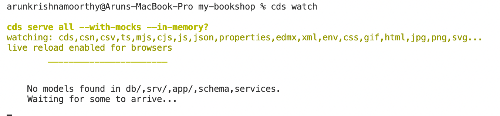

# Setting up a new Project in VS Code

#### Step 1: Initialize a project

To start a new CAP Project for development, open the visual studio code and open a workspace/folder location where you want to build your service. 

Execute the following command to initialize a new project. 

```
cds init <name_of_project>
```

Example:

``` 
cds init my-bookshop 
``` 

This command creates a directory called my-bookshop in the current directory where your VS Code terminal is at. 



After initializing the project, you should see the following folders.



- app : For UI artifacts 
- db  : For database level schema models 
- src : Service definition layer

#### Step 2: Install Dependencies 

In the terminal window, navigate the terminal to the new directory created. 

```
cd my-bookshop
```
The package.json file generated for the node project contains the list of dependencies required for the CAP Service. To install the dependencies 
execute the node command install. 

```
npm install
``` 

This command reads the package.json file and install all the node package mentioned as dependencies. 



#### Step 3: Execute the project 

To execute the CAP application, run the command cds watch. What this command does is start a localhost server and serve the contents of the project. 
It enables live reload on the browser and whenever there is a change in the project files the changes are automatically tracked and you can see them reflecting on the server without the need to restart the service everytime. 

```
cds watch
```



The project is not started yet, as there is no contents.

Next Steps: [Define the service for my-bookshop](define-my-bookshop-service.md)

